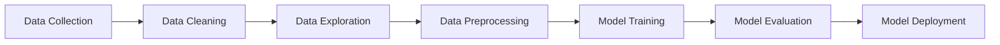

## **Data Science Cheat Sheet**





### **1. Data Collection & Cleaning**

*Depending on the dataset and the specific problem, additional or different steps might be needed.*

- **Pandas**:
  ```python
  import pandas as pd
  df = pd.read_csv('data.csv')
  df.head()
  df.dropna(inplace=True)
  ```

- **Missing Values**:
  ```python
  df.fillna(method='bfill')
  ```

- More on [[1]](#1)

### **2. Data Exploration & Visualization**

*In this step, the aim is to gain insights into the dataset, identify patterns, anomalies, or any relationships between variables. Visualization plays a crucial role as it helps to understand and communicate these findings effectively. The tools and techniques chosen largely depend on the type and structure of the data and the specific questions you are trying to answer.*

- **Matplotlib & Seaborn**:
  ```python
  import matplotlib.pyplot as plt
  import seaborn as sns
  
  sns.histplot(df['column_name'])
  plt.show()
  ```

  - More on [[2]](#2)

### **3. Preprocessing**

*Data preprocessing often requires multiple iterations, adjustments, and validations to ensure that the data is well-prepared for the modeling phase. The exact steps and techniques depend on the dataset's nature and the specific problem being tackled.*

- **Scikit-learn**:
  ```python
  from sklearn.preprocessing import StandardScaler
  
  scaler = StandardScaler()
  X_scaled = scaler.fit_transform(X)
  ```

- More on [[3]](#3)

### **4. Machine Learning**

*Model training involves experimenting with various algorithms and techniques to find the best model for the given data and problem. It's often an iterative process, where insights from model evaluation (next step) lead to further refinement in model training.*

- **Train/Test Split**:
  ```python
  from sklearn.model_selection import train_test_split
  
  X_train, X_test, y_train, y_test = train_test_split(X, y, test_size=0.2)
  ```

- **Regression**:
  ```python
  from sklearn.linear_model import LinearRegression
  
  model = LinearRegression().fit(X_train, y_train)
  predictions = model.predict(X_test)
  ```

- **Classification**:
  ```python
  from sklearn.ensemble import RandomForestClassifier
  
  clf = RandomForestClassifier().fit(X_train, y_train)
  predictions = clf.predict(X_test)
  ```

- More on [[4]](#4)

### **5. Evaluation**

*The evaluation phase is iterative. Based on the results of the evaluation, one might go back to preprocess the data differently, engineer other features, or try different algorithms or hyperparameters, and then re-evaluate. This iterative process continues until the desired level of performance is achieved.*

- **Metrics**:
  ```python
  from sklearn.metrics import mean_squared_error, accuracy_score
  
  mse = mean_squared_error(y_test, predictions)
  acc = accuracy_score(y_test, predictions)
  ```

- More on [[5]](#5)

### **6. Deep Learning**

*Model deployment is the phase where all the work done in data preprocessing, model training, and evaluation becomes actionable. It's where the rubber meets the road, making all the efforts in the earlier steps deliver real-world value. However, deployment is not the end; it's essential to continuously monitor, maintain, and update models as needed.*

- **TensorFlow & Keras**:
  ```python
  from tensorflow.keras.models import Sequential
  from tensorflow.keras.layers import Dense
  
  model = Sequential([Dense(units=32, activation='relu', input_shape=(X_train.shape[1],)),
                      Dense(units=1)])
  model.compile(optimizer='adam', loss='mse')
  model.fit(X_train, y_train, epochs=10)
  ```

  - More on [[6]](#6)

### **7. Deployment**

*In the post-deployment phase, a proactive approach is key. Being reactive can lead to degraded performance or model failures that impact user experience or business operations. Setting up robust monitoring and feedback mechanisms will ensure the model remains valuable and relevant over time.*

- **Flask**:
  ```python
  from flask import Flask, request
  
  app = Flask(__name__)

  @app.route('/predict', methods=['POST'])
  def predict():
      data = request.json
      # Use model to predict
      return prediction
  ```

- More on [[7]](#7)

## Details on individual phases 

<a id="1">[1]</a>
Data Collection & Cleaning

### **1.1 Data Collection**

- **Web Scraping**:
  - **Beautiful Soup**:
    ```python
    from bs4 import BeautifulSoup
    import requests

    response = requests.get('URL')
    soup = BeautifulSoup(response.content, 'html.parser')
    data = soup.find_all('tag_name', attrs={'attribute_name': 'value'})
    ```

  - **Scrapy**:
    ```bash
    scrapy startproject projectname
    ```
    Then follow the Scrapy documentation to create and run a spider.

- **APIs**:
  ```python
  import requests

  response = requests.get('API_URL', headers={'Authorization': 'Bearer YOUR_TOKEN'})
  data = response.json()
  ```

- **Databases**:
  - **SQL**:
    ```python
    import sqlite3

    conn = sqlite3.connect('database_name.db')
    df = pd.read_sql_query("SELECT * FROM tablename", conn)
    ```

  - **NoSQL (e.g., MongoDB)**:
    ```python
    from pymongo import MongoClient

    client = MongoClient('localhost', 27017)
    db = client['database_name']
    collection = db['collection_name']
    data = collection.find({})
    ```

### **1.2 Data Cleaning**

- **Handling Missing Data**:
  - Drop missing values:
    ```python
    df.dropna(inplace=True)
    ```

  - Forward fill:
    ```python
    df.fillna(method='ffill', inplace=True)
    ```

  - Backward fill:
    ```python
    df.fillna(method='bfill', inplace=True)
    ```

  - Fill with specific value:
    ```python
    df.fillna(value=0, inplace=True)
    ```

- **Handling Duplicate Data**:
  ```python
  df.drop_duplicates(inplace=True)
  ```

- **Data Type Conversion**:
  ```python
  df['column_name'] = df['column_name'].astype('data_type')
  ```

- **String Manipulation**:
  - Removing whitespace:
    ```python
    df['column_name'] = df['column_name'].str.strip()
    ```

  - Convert to lowercase:
    ```python
    df['column_name'] = df['column_name'].str.lower()
    ```

  - Extracting substrings using regex:
    ```python
    df['extracted_data'] = df['column_name'].str.extract(r'pattern')
    ```

- **Handling Outliers**:
  Often done using methods like IQR (Interquartile Range) or Z-scores.

  ```python
  Q1 = df['column_name'].quantile(0.25)
  Q3 = df['column_name'].quantile(0.75)
  IQR = Q3 - Q1
  filter = (df['column_name'] >= Q1 - 1.5 * IQR) & (df['column_name'] <= Q3 + 1.5 * IQR)
  df = df[filter]
  ```

- **Feature Engineering**:
  - Binning:
    ```python
    bins = [0, 10, 20, 30]
    labels = ['0-10', '10-20', '20-30']
    df['binned_column'] = pd.cut(df['column_name'], bins=bins, labels=labels)
    ```

  - Encoding (e.g., One-Hot Encoding):
    ```python
    df = pd.get_dummies(df, columns=['categorical_column'])
    ```

<a id="2">[2]</a> 
Data Exploration & Visualization

### **2.1 Data Exploration**

Exploratory Data Analysis (EDA) involves understanding the main characteristics of a dataset, often using statistical graphics, plots, and information tables.

- **Descriptive Statistics**:
  ```python
  df.describe()  # Provides summary statistics for numerical columns.
  ```

- **Unique Values**:
  ```python
  df['column_name'].unique()  # Lists unique values in a column.
  ```

- **Value Counts**:
  ```python
  df['column_name'].value_counts()  # Frequency count for unique values.
  ```

- **Correlation**:
  ```python
  df.corr()  # Gives the correlation matrix for numerical columns.
  ```

### **2.2 Data Visualization**

- **Matplotlib**:
  - Basic Plot:
    ```python
    import matplotlib.pyplot as plt
    
    plt.plot(df['column_name'])
    plt.xlabel('X-axis label')
    plt.ylabel('Y-axis label')
    plt.title('Title of the plot')
    plt.show()
    ```

  - Histogram:
    ```python
    plt.hist(df['column_name'], bins=10)
    plt.show()
    ```

- **Seaborn**:
  - Boxplot:
    ```python
    import seaborn as sns
    
    sns.boxplot(data=df, x='x_column', y='y_column')
    ```

  - Heatmap (useful for visualizing correlation matrix):
    ```python
    correlation_matrix = df.corr()
    sns.heatmap(correlation_matrix, annot=True, cmap='coolwarm')
    ```

  - Pairplot (visualize pairwise relationships in a dataset):
    ```python
    sns.pairplot(df)
    ```

  - Count Plot (visualize frequency distribution of a categorical variable):
    ```python
    sns.countplot(data=df, x='categorical_column')
    ```

- **Pandas built-in visualization**:
  - Scatter Matrix (visualizes pairwise relationships and distributions):
    ```python
    from pandas.plotting import scatter_matrix
    
    scatter_matrix(df, figsize=(10, 10))
    plt.show()
    ```

  - Pie Chart:
    ```python
    df['column_name'].value_counts().plot.pie(autopct='%1.1f%%')
    ```

- **Plotly and Bokeh**:
  These are additional libraries to create interactive plots, which can be especially helpful for exploring data in web applications or Jupyter notebooks.

### **2.3 Data Profiling with Pandas Profiling**:

Pandas Profiling provides a quick way to perform an initial exploratory analysis of your dataset.
  
  ```python
  from pandas_profiling import ProfileReport
  
  profile = ProfileReport(df, title="Pandas Profiling Report")
  profile.to_widgets()
  ```

<a id="3">[3]</a> 
Data Preprocessing

Data preprocessing is a crucial step in the data analysis process, as the quality of data and the usefulness of the dataset will determine the ability of models to find patterns.

### **3.1 Scaling and Normalization**

Many machine learning algorithms perform better when numerical input attributes are scaled to a standard range.

- **Standardization (Z-score Normalization)**:
  Scales features such that the distribution is centered around 0, with a standard deviation of 1.
  
  ```python
  from sklearn.preprocessing import StandardScaler
  
  scaler = StandardScaler()
  X_standardized = scaler.fit_transform(X)
  ```

- **Min-Max Scaling**:
  Transforms features by scaling each feature to a given range (e.g., [0, 1]).
  
  ```python
  from sklearn.preprocessing import MinMaxScaler
  
  scaler = MinMaxScaler()
  X_scaled = scaler.fit_transform(X)
  ```

### **3.2 Encoding Categorical Variables**

Many algorithms expect numerical input values, necessitating the encoding of categorical variables.

- **Label Encoding**:
  Converts each value in a column to a number.
  
  ```python
  from sklearn.preprocessing import LabelEncoder
  
  le = LabelEncoder()
  df['encoded_column'] = le.fit_transform(df['categorical_column'])
  ```

- **One-Hot Encoding**:
  Converts categorical variable(s) into a new column for each unique value and marks it as 0 or 1.
  
  ```python
  df_encoded = pd.get_dummies(df, columns=['categorical_column'])
  ```

### **3.3 Handling Imbalanced Datasets**

In many real-world scenarios, one class of data may heavily outnumber the other class(es). This can be problematic for many machine learning algorithms.

- **Oversampling**:
  Increase the number of instances of the minority class by duplicating samples or generating synthetic samples.
  
  ```python
  from imblearn.over_sampling import SMOTE
  
  smote = SMOTE()
  X_resampled, y_resampled = smote.fit_resample(X, y)
  ```

- **Undersampling**:
  Reduce the number of instances from the majority class, often by random deletion.
  
  ```python
  from imblearn.under_sampling import RandomUnderSampler
  
  rus = RandomUnderSampler()
  X_resampled, y_resampled = rus.fit_resample(X, y)
  ```

### **3.4 Feature Engineering**

- **Feature Extraction**:
  - **Principal Component Analysis (PCA)**:
    Reduces the dimensionality of the data by transforming it into a new coordinate system.
    
    ```python
    from sklearn.decomposition import PCA
    
    pca = PCA(n_components=number_of_components)
    X_pca = pca.fit_transform(X)
    ```

- **Feature Selection**:
  - **Recursive Feature Elimination (RFE)**:
    Recursively removes attributes and builds a model on attributes that remain.
    
    ```python
    from sklearn.feature_selection import RFE
    from sklearn.linear_model import LogisticRegression
    
    estimator = LogisticRegression()
    selector = RFE(estimator, n_features_to_select=number_of_features)
    selector = selector.fit(X, y)
    ```

### **3.5 Splitting Data**

Before building models, it's common to split data into training and test datasets. Sometimes, a validation dataset is also used.

```python
from sklearn.model_selection import train_test_split

X_train, X_test, y_train, y_test = train_test_split(X, y, test_size=0.2, random_state=42)
```

<a id="4">[4]</a> 
Model Training

This step focuses on training machine learning models using the prepared data. The goal is to find the best algorithm that captures the underlying patterns in the data.

### **4.1 Model Selection**

Depending on the nature of the task (classification, regression, clustering, etc.), various algorithms can be chosen:

- **Classification**:
  - Logistic Regression
  - Decision Trees
  - Random Forest
  - Support Vector Machines
  - Neural Networks
  - K-Nearest Neighbors

- **Regression**:
  - Linear Regression
  - Polynomial Regression
  - Decision Trees
  - Random Forest
  - Neural Networks

- **Clustering**:
  - K-Means Clustering
  - Hierarchical Clustering
  - DBSCAN

### **4.2 Training a Model**

Using the selected model, it's trained with the training dataset:

```python
from sklearn.ensemble import RandomForestClassifier

model = RandomForestClassifier()
model.fit(X_train, y_train)
```

### **4.3 Hyperparameter Tuning**

Hyperparameters are the parameters not learned from the data and are set prior to training. Tuning them can improve model performance:

- **Grid Search**:

  ```python
  from sklearn.model_selection import GridSearchCV
  
  parameters = {'n_estimators': [10, 50, 100], 'max_depth': [None, 10, 20, 30]}
  grid_search = GridSearchCV(estimator=model, param_grid=parameters, scoring='accuracy', cv=5)
  grid_search.fit(X_train, y_train)
  best_params = grid_search.best_params_
  ```

- **Random Search**:

  ```python
  from sklearn.model_selection import RandomizedSearchCV
  
  parameters = {'n_estimators': [10, 50, 100], 'max_depth': [None, 10, 20, 30]}
  random_search = RandomizedSearchCV(estimator=model, param_distributions=parameters, n_iter=10, scoring='accuracy', cv=5)
  random_search.fit(X_train, y_train)
  best_params = random_search.best_params_
  ```

### **4.4 Cross-Validation**

Cross-validation is a technique to assess the expected performance of a model on unseen data:

```python
from sklearn.model_selection import cross_val_score

scores = cross_val_score(model, X_train, y_train, cv=5)
```

### **4.5 Handling Overfitting**

Overfitting occurs when a model captures noise in the training data and performs poorly on new, unseen data:

- **Regularization**: Techniques like L1 and L2 regularization add a penalty to the loss function, discouraging overly complex models.
  
- **Early Stopping**: Especially in neural networks, training can be stopped once the validation error starts increasing, even if the training error continues to decrease.

- **Pruning**: For decision trees, pruning can be used to remove parts of the tree that do not provide power to classify instances.

<a id="5">[5]</a> 
Model Evaluation

Once a model is trained, it's vital to assess its performance on unseen data to ensure its generalization capability. Model evaluation provides insights into the quality of the model and areas for potential improvement.

### **5.1 Train/Test Split Evaluation**

After training on the training set, test the model on a separate test set to evaluate its performance.

```python
predictions = model.predict(X_test)
```

### **5.2 Classification Metrics**

For classification tasks, various metrics can be used:

- **Accuracy**: The ratio of correctly predicted instances to the total number of instances.
  
- **Precision, Recall, and F1-Score**: Precision is the number of true positives divided by the number of true positives plus the number of false positives. Recall is the number of true positives divided by the number of true positives plus the number of false negatives. F1-Score is the harmonic mean of precision and recall.

  ```python
  from sklearn.metrics import classification_report
  print(classification_report(y_test, predictions))
  ```

- **Confusion Matrix**: Represents the counts of true positive, true negative, false positive, and false negative predictions.

  ```python
  from sklearn.metrics import confusion_matrix
  print(confusion_matrix(y_test, predictions))
  ```

- **ROC and AUC**: Receiver Operating Characteristic (ROC) curve is a plot of the true positive rate against the false positive rate. The Area Under the Curve (AUC) provides a scalar value of the performance.

  ```python
  from sklearn.metrics import roc_curve, roc_auc_score
  fpr, tpr, thresholds = roc_curve(y_test, predictions)
  auc_score = roc_auc_score(y_test, predictions)
  ```

### **5.3 Regression Metrics**

For regression tasks, common evaluation metrics include:

- **Mean Absolute Error (MAE)**: The average of the absolute differences between predictions and actual values.
  
- **Mean Squared Error (MSE)**: The average of the squared differences between predictions and actual values.

- **Root Mean Squared Error (RMSE)**: The square root of the MSE.

- **R-squared**: Measures the proportion of the variance in the dependent variable that is predictable from the independent variables.

  ```python
  from sklearn.metrics import mean_absolute_error, mean_squared_error, r2_score
  mae = mean_absolute_error(y_test, predictions)
  mse = mean_squared_error(y_test, predictions)
  rmse = np.sqrt(mse)
  r2 = r2_score(y_test, predictions)
  ```

### **5.4 Model Comparison**

When multiple models or versions of a model are trained, they need to be compared using the evaluation metrics.

### **5.5 Overfitting and Underfitting**

It's crucial to monitor for overfitting (where the model performs very well on the training data but poorly on the test data) or underfitting (where the model performs poorly on both training and test data). Techniques like cross-validation can help detect these issues.

<a id="6">[6]</a> 
Model Deployment

After training and evaluating a model, the next step is deploying it to a production environment where it can start taking in inputs and making predictions in real-time or on a scheduled basis. Model deployment is about making your model available to end-users or systems.

### **6.1 Deployment Platforms**

Several platforms allow for model deployment:

- **Local Deployment**: This is when the model runs on a local machine or server. Often achieved using frameworks like Flask or Django for Python models.
  
- **Cloud Deployment**: Major cloud providers offer Machine Learning services that allow for model deployment and scaling:
  - AWS SageMaker (Amazon Web Services)
  - Google AI Platform (Google Cloud)
  - Azure ML (Microsoft Azure)

- **Containers**: Using Docker or Kubernetes, models can be containerized and then deployed. This ensures consistency in the runtime environment.

- **Edge Deployment**: Deploying the model on edge devices like IoT devices.

### **6.2 API Endpoints**

When deploying a model, often it's exposed as a RESTful API which applications can call:

```python
# Using Flask as an example
from flask import Flask, request, jsonify
import joblib

app = Flask(__name__)
model = joblib.load('model.pkl')

@app.route('/predict', methods=['POST'])
def predict():
    data = request.get_json(force=True)
    prediction = model.predict([data['input']])
    return jsonify(prediction=prediction[0])

if __name__ == '__main__':
    app.run(port=5000)
```

Applications can now make a POST request to `/predict` to get predictions.

### **6.3 Versioning**

As models are updated and retrained, it's essential to have version control to ensure reproducibility and track changes.

- **Model Versioning Tools**: Tools like MLflow or DVC can help in versioning models.

### **6.4 Monitoring and Logging**

Once deployed, it's crucial to monitor the model's performance in real-time:

- Track the inputs and outputs
- Monitor resource usage (memory, CPU)
- Watch for model drift over time

### **6.5 Continuous Integration and Deployment (CI/CD)**

Incorporating machine learning models into a CI/CD pipeline ensures that any updates to the model or related components are automatically tested and deployed.

### **6.6 Rollback Strategy**

Having a rollback strategy is vital. If a newly deployed model version has unforeseen issues, there should be a way to quickly revert to a previous stable version.

### **6.7 Scalability**

Models, especially when exposed as APIs, should be able to handle multiple requests and scale as demand grows. Cloud deployment options often come with auto-scaling features. For local deployments, tools like Kubernetes can help.

<a id="7">[7]</a> 
Post-deployment Monitoring & Maintenance

Once a model is deployed, the work doesn't stop. It's essential to continuously monitor the model to ensure that it's performing as expected and to maintain its relevancy over time as data and requirements change.

### **7.1 Monitoring Model Performance**

- **Feedback Loop**: Establish a system where real-world outcomes (actual results) are compared with model predictions to evaluate ongoing accuracy.

- **Dashboards**: Use monitoring tools or custom dashboards to visualize model performance metrics in real-time. Tools like Grafana, Kibana, or cloud-specific monitoring solutions can be handy.

- **Model Drift**: Monitor for changes in the statistical properties of the model's input data over time, which can degrade model performance. It's essential to be aware when the data the model is scoring in production begins to differ significantly from the data it was trained on.

### **7.2 Retraining Strategy**

- **Continuous Learning**: Depending on the domain and the rate of change in data, decide on a strategy to retrain your model. This could be on a set schedule (e.g., monthly) or based on a performance trigger (e.g., if accuracy drops below a certain threshold).

- **Automated Retraining**: Set up pipelines that can automatically retrain models using new data and re-deploy them.

### **7.3 Data Quality Monitoring**

- **Anomaly Detection**: Implement systems to detect anomalies in input data. Any significant deviations or inconsistencies in the incoming data can affect model predictions.

- **Data Validation**: Ensure that incoming data adheres to expected formats and ranges. Reject or flag any data points that don't meet the criteria.

### **7.4 Model Explainability and Transparency**

- **Interpretability Tools**: Use tools and techniques that help in understanding model predictions. Tools like SHAP (SHapley Additive exPlanations) or LIME (Local Interpretable Model-agnostic Explanations) can be beneficial.

- **Auditing and Compliance**: For certain industries, it might be necessary to audit the model's decisions and ensure that they comply with regulations.

### **7.5 Handling Feedback and Updates**

- **User Feedback**: Collect feedback from end-users or systems that interact with your model. This feedback can provide valuable insights into areas of improvement.

- **Iterative Improvement**: Machine Learning models are rarely "done". Use feedback and performance metrics to continually refine and improve the model.

### **7.6 Scalability and Resource Management**

- **Resource Monitoring**: Keep an eye on system resources like CPU, memory, and network usage to ensure the deployed models run efficiently.

- **Optimization**: Depending on resource consumption and prediction latency, consider techniques to optimize your model, like model quantization, pruning, or using lighter model architectures.
